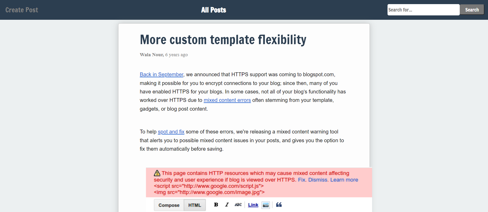

# React Application : Bloggin App

## Sprint Objective

Our goal is to create a dynamic single page bloggin application

### React

React is as a free and open-source front-end JavaScript library for building user interfaces based on UI components. It is maintained by Meta (formerly Facebook) and a community of individual developers and companies.

React is an awesome tool to create well written web apps, as you can build encapsulated components that manage their own state, then compose them to make complex UIs, and since component logic is written in JavaScript instead of templates, you can easily pass rich data through your app and keep state out of the DOM.

React makes it painless to create interactive UIs. Design simple views for each state in your application, and React will efficiently update and render just the right components when your data changes.

Declarative views make your code more predictable and easier to debug.

### A lot to Learn about React

 #### JSX and ES6 Syntax

JSX is a syntax extension to JavaScript. Used with React to describe what the UI should look like. JSX may remind you of a template language, but it comes with the full power of JavaScript.

JSX produces React “elements”. We will explore rendering them to the DOM in the next section. [Here](https://reactjs.org/docs/introducing-jsx.html), you can find the basics of JSX necessary to get you started.

ES6 is full of surprises check these two amazing cheat sheets
[here](https://devhints.io/es6) to learm more about, destructuring,
ES6 modules and other feautres of ES6.

#### Transpilers and code bundlers

The browser does not understand JSX syntax, therefore we need a transpiler like [Babel](https://babeljs.io/).
We also may use a lot of assets especially in front end development like CSS, SASS, fonts and images... and therefore we need a code bundler like [webpack](https://webpack.js.org/).  
For this sprint you don't have to worry about configuring babel and webpack, but you can check `webpack.config.js` and `.babelrc` files to have an idea about such configurations.

#### Think in React 

You will need to start [thinking in React](https://reactjs.org/docs/thinking-in-react.html)

### Your Project

Install your dependecies using `npm install` check your scripts in `package.json ` then run your app and open the `dist/index.html` file with Live Server

#### Folder Structure

#### check the folder structure

  

The app contains the following components   

#### 1- OnePost 
OnePost is a simple `function` component that displays one post

   

#### 2- AllPosts 
A `function` component which is supposed to map over a collection of blog data taken as a `props` and render a list of its child component `PostDetails`

   

#### 3- CreatePost 
A `function` component Should have inputs that enable the user to post blogs   

   

#### 4- Search 
A `function` component that contains inputs to enable the user to search for a blog    

   

#### 5- App component 
The main stateful `class component` that renders the whole application.

   

  

### Basic Requirements

- [ ] Check your `src/index.js`, render the `App` component to the DOM and explore the codebase to get an understanding of each component's responsibility.
      Hint: take a look at React docs and take your baby steps to learn the basic concepts [React docs](https://reactjs.org/docs/getting-started.html) ;)

- [ ] Use your dummy data `src/data/exampleBlogData.js` to render your `AllPosts`, keep using `props` to render a `PostDetails` component for every post object of the dummy data.
      [momentjs](https://momentjs.com/) can be very helpful if you need date parsing

- [ ] Make your application render `OnePost` whenever the user clicks on the blog's title

Be careful when you handle blog content, try to use [html-react-parser](https://www.npmjs.com/package/html-react-parser) to parse your content so you can render nice blogs ;)

- [ ] Check your conditional rendreing mechanism, and update it so it can render a `CreatePost` component when a user clicks on the create post button.  
**NOTE**: `CreatePost` is a `function` component using the [useState](https://reactjs.org/docs/hooks-state.html) Hook from React to be able to use state without writing a class

### Advanced

- [ ] Make your app interacts with the blogger API, your instructors will provide you with the credentials.

- [ ] Implement a live `Search` feauture in your blogging app, and make use of [react component life cycle](https://reactjs.org/docs/state-and-lifecycle.html), so your app can intiate with data

- [ ] Refactor your application to use [React hooks](https://reactjs.org/docs/hooks-intro.html)
      No class components anymore !!!!

- [ ] You have some starter code for [react router](https://reactrouter.com/) refactor your app and replace conditional rendering with it.

- [ ] Refactor your application to [Redux](https://redux.js.org/)
